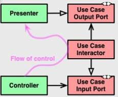

# Clean architecture/DDD training

Ici sont les notes de mon voyage vers le monde du DDD avec la Clean architecture et diverses autres techniques.

## Notes

Pour une to-do list, l'accumulation de toutes les notions ci-dessous et probablement très overkill.

Une simple application MVC bien testée aurait été beaucoup plus rapide et efficace.

Il faut bien évaluer avant chaque projet quelles techniques mettre en place, car même si ces techniques sont beaucoup plus rentables sur des gros projets / projets sur le long terme. Elles demandent plus de temps à mettre en place en début de projet.

## But

Le but des différentes techniques ci-dessous est:

- Séparation claire entre la logique métier et l'applicatif.
- Permettre de mieux comprendre le métier et ses règles.
- Produire un code plus propre et plus lisible.
- Découpler certaines parties d'un projet afin de réduire le nombre de dépendances. (changer le module A affecte 456 modules liés à A)
- Se rendre indépendant des outils/Frameworks/méthode de livraison des données. La base de données est un détail.
- Avoir un code facilement testable.

## Clean architecture

### A savoir

- Les dépendances pointent vers l'extérieur.
  - ex : la couche framework dépend de la couche adapter mais pas l'inverse.
- Chaque couche communique à l'aide de data structures simples.
- Focalisé business (le centre). Plus on s'éloigne du centre plus ça devient anecdotique pour le comportement de l'application.
- Interactor = use case.
- Chaque couche est indépendament testable.

### les couches

Du centre vers l'extérieur.
D'autres couches peuvent être ajoutées, il faut juste appliquer les principes ci-dessus.

--- business (CORE)

- Entités
- Application

--- implémentation (séparé par ce qu'on appelle une boundary/frontière)

Les adaptateurs qui indiquent à notre application de faire quelque chose sont appelés adapteurs primaires, tandis que ceux auxquels notre application demande de faire quelque chose sont appelés adapteurs secondaires.

- Adapteurs
  - Primaires:
    - Une route
    - Une commande shell
    - Un cron
  - Secondaires : Points de sortie de l'application
    - Repository
    - Client Mail, SMS
- Frameworks

on ne retourne pas d'objet métier depuis les use-cases !

#### Ports

Un port peut être une interface de service ou une interface de repository requise par un controller. L'implémentation concrète du Service, du Repository ou de la Query est ensuite injectée et utilisée dans le Controller.

##### Presenters

Le Presenter est un `Humble Object`. Il sert à transformer le retour du Use Case de manière correcte pour la `Vue`.
Il est également testable plus facilement qu'une Vue entière.

Ayant fait l'erreur et vu l'erreur autre part :
=> Le `Controller` ne doit pas connaître le `Presenter` !

Explication plus détaillée du l'image ci-dessus:

- Le `Controller` appelle le `Use Case (Interactor)` en passant les données via une Interface `Input Port` (généralement un DTO).
- Le `Use case` appelle ensuite le `Presenter` avec des données `Output Port` qui vont permettre de "présenter" la donnée.

à noter que le `Presenter` n'est pas obligatoire.

### CQRS

*Pas mis en application car un peu trop overkill, mais Good To Know*.

Séparation des opérations READ/WRITE.

Représentation différente des opérations read et write.

Utilisation de commandes pour écrire des données et de queries pour lire les données.

- Les queries
  - Ne modifient pas l'état du système.
  - Retourne un DTO
- Les commandes .
  - Elles sont task-based, et non model centric.
  - Changement d'état du système.

Dans ce cas un use case ne pourra pas read/write en même temps.

Un use-case est donc soit une `command` ou une `query`.

## Event Sourcing

Ne pas confondre avec les évènements du DDD.

- Accumulation d'events, qui rendent l'application immutable.
- L'on peut restaurer l'état de l'application à un instant T grâce à l'ES.
- Seulement Create/Read.

## Using DDD

### Concepts

#### Ubiquitous Language

Langage commun entre les gens du métier et le developpeur.

#### Bounded Context

#### AggregateRoots

Entités gérants plusieurs entités qui ne savent exister sans celles-ci.

La validation doit se trouver le plus proche de l'entité. Pour ne pas que l'entité devienne.

La majeure partie de la logique domaine doit se trouver dans les entités. Pour ne pas que ceux-ci deviennent anémiques.

#### Value Objects

Représente un type et encapsule la logique de validation d'un type.

> The bad practice of using primitive types to represent an object in a domain is so common that has even a name: primitive obsession.

Ils ont 3 caractéristiques principales:

- `immutability`
- `value equality`
- `self validation`

#### Domain Services

Ces services peuvent être également des use-case dans la Clean Archi.

- The operation relates to a domain concept that is not a natural part of an Entity or Value Object
- The interface is defined in terms of other elements in the domain model
- The operation is stateless

#### Domain Events

Permettent de découpler la logique.

Pour chaque Events, il faut identifier

- Les acteurs
- Les comandes
- Les évènements
- Qui sousscrit à ces évènements

On peut faire ceci grâce à l'Event Storming. (Comme le brain Storming)

Les évènements permettent également de séparer le couplage entre les différentes parties du code. Les différents modules subscribent sur les évènements dont ils ont besoin.

Les données des évènements doivent être en Read-Only.

L'ORM/DB a le devoir de décider quand les évènements peuvent être dispatchés. Car c'est lui seul qui sait si les données ont bien été traitées/persistées vers le moteur de stockage. Dans ce cas-ci, ce serait soit au repository, soit aux hooks de l'ORM de s'en charger.

#### Application Services

## Using functionnal programming

Dans ce projet, j'ai commencé à utiliser un peu de programmation fonctionnelle via la librairie `true-myth`. Permettant de gérer les erreurs/undefined/null de manière efficace et Typescript-Aware.

*ça n'a rien à voir avec le DDD ni la CA*.

## FAQ

### Où placer la validation ?

Celà dépend grandement du cas, si votre validation touche à une règle métier alors elle doit être dans les couches du domaine.
Si vous validez par exemple un format JSON ou autre chose qui ne touche pas au métier ou n'est pas une règle absolue pour votre métier alors elle doit se trouver dans les couches application.

### Où placer la logique d'Authorization ?

La logique d'authorization dépend également si votre logique est absolue au domaine ou pas. Si un utilisateur ne peut créer un todo que dans une todolist qui lui appartient la logique doit être côté domaine.

### Où placer la logique d'Authentification ?

L'authentication doit être agnostique du métier, que l'on se connecte avec du JWT, Session, Facebook, ... Celà est égal pour le domaine. Le domaine veut juste savoir `qui` et pas `comment`.

(Les paroles ci-dessus ne sont pas absolues)

## Regrouper sous forme de components

Regrouper sous forme de components permet de réduire le *coupling* entre différentes parties de l'application. Et rendre chacun de ces components indépendemmment testables.
Un component peut être sous forme d'un package.

### Reuse/Release Equivalency Principle

Il faut avoir une processus de release. SemVER.

### Common Closure Principle

Un component ne contient que les classes qui changent pour la même raison.(SRP). Ex: Toutes les classes qui dealent avec la DB dans le même component, les classes Business dans le même component etc ...
Si un changement survient dans l'application, il faut pouvoir changer un minimum de components possibles. (Best Case 1).

### CRP Common Reuse Principle

Séparer pour éviter des releases inutiles pour les modules dépendants. (Ex: certains changements apportés dans un module n'apportent aucune valeur ajoutée poru certains modules dépendants de celui-ci).

*Les 3 principes ci-dessus se repoussent et s'opposent*

=> La structure des components évolue au fil du temps. Elle n'est pas statique.

### ADP Acyclic dependency principle

=> Pas de cycles dans les dépendances !

Les dépendances peuvent être cassées grâce à une interface.

### SDP Stable dependency Principle

La stabilité est la difficulté à changer un module.

Adult = n'a aucune dépendance mais est dépendu.
Teenager = n'a que des dépendances mais personne n'en dépend.

Métrique d'instabilité : I = Ce/(Ca + Ce)

### SAP The stable abstraction principle

Abstractness d'un component = Na / N.
  Na = Nombre de classes abstraites.
  N = Nombre de classes.

Abstractions sans dépendances sont inutiles.
Concretions avec beaucoup de dépendances sont horribles.

## Sources

<https://martinfowler.com>
<https://www.schneier.com/blog/archives/2011/04/schneiers_law.html>
<https://lostechies.com/jimmybogard/2010/02/04/strengthening-your-domain-a-primer/>
<https://www.entropywins.wtf/blog/2016/11/24/implementing-the-clean-architecture/>
<https://herbertograca.com/2017/11/16/explicit-architecture-01-ddd-hexagonal-onion-clean-cqrs-how-i-put-it-all-together/#fundamental-blocks-of-the-system>
<https://philippe.bourgau.net/how-to-use-event-storming-to-introduce-domain-driven-design/>
<https://khalilstemmler.com/articles/typescript-domain-driven-design/entities/>
<https://www.martinfowler.com/bliki/PresentationDomainDataLayering.html>
<https://medium.com/spotlight-on-javascript/domain-driven-design-for-javascript-developers-9fc3f681931a>
<https://ddimitrov.dev/2020/12/13/domain-driven-design-and-clean-architecture/>
<https://www.freecodecamp.org/news/modern-clean-architecture/>
<https://medium.com/codex/avoiding-code-hotspots-a-use-case-driven-approach-2bcc12e4b878>
<https://pusher.com/tutorials/clean-architecture-introduction/>
<https://adevelopersdiscourse.blogspot.com/2020/06/clean-architecture-demystified.html>
<https://www.infoq.com/articles/ddd-contextmapping/>
<https://medium.com/unil-ci-software-engineering/clean-domain-driven-design-2236f5430a05>

### Youtube

<https://youtu.be/N7agCpAYp1Q>

### Github

<https://github.com/wmde/fundraising-application>
<https://github.com/wmde/fundraising-donations>
<https://github.com/hgraca/explicit-architecture-php>
<https://github.com/stemmlerjs/white-label>
<https://github.com/VaughnVernon/IDDD_Samples>
<https://github.com/dotnet-architecture/eShopOnContainers>
<https://github.com/cleancoders/CleanCodeCaseStudy>
<https://github.com/culttt/cribbb>
<https://github.com/4lessandrodev/finance-project-ddd>

### Outils

<https://contextmapper.org/>
